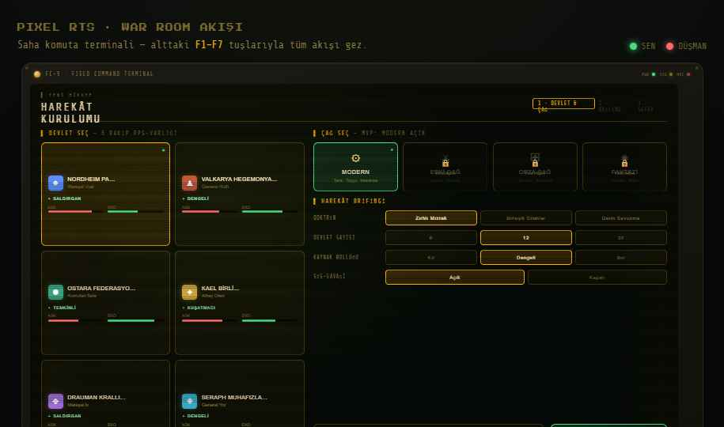
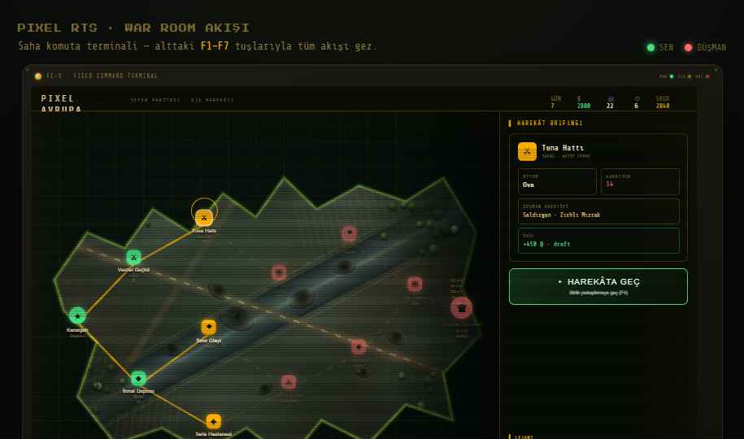
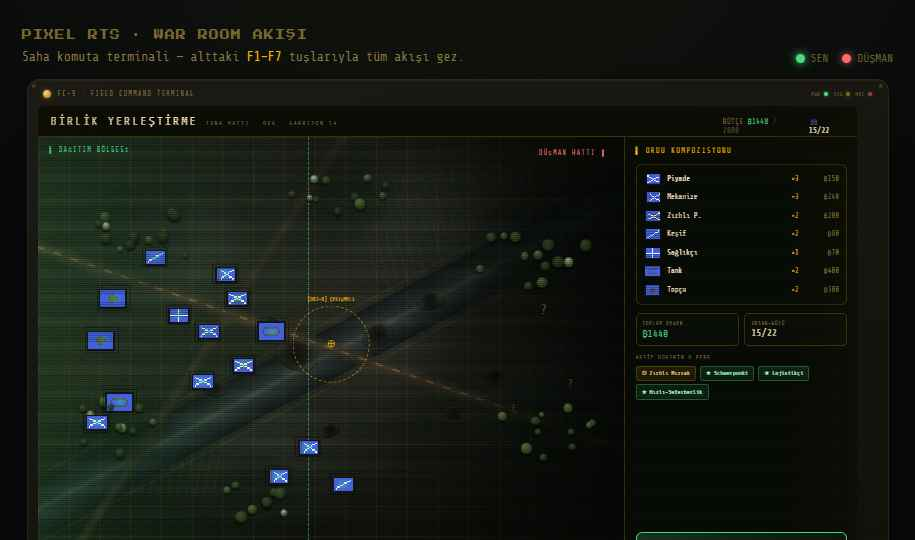
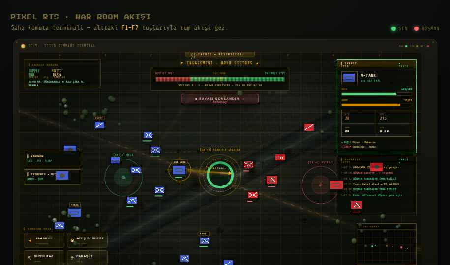
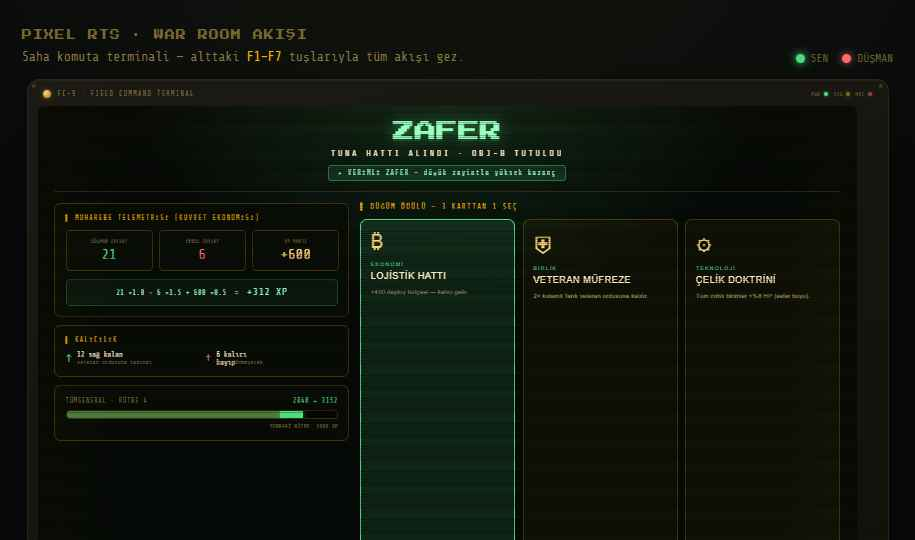
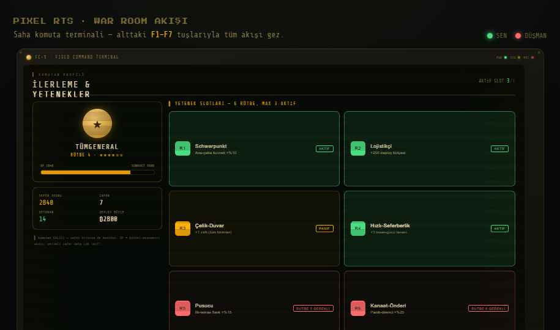

# Handoff: Pixel RTS — War Room Arayüz Sistemi

## Genel Bakış
Bu paket, **Pixel RTS** için "War Room" (amber fosfor komuta konsolu) görsel yönünde
tasarlanmış **7 ekranlık** tam akışın arayüz referansıdır:
Ana Menü → Hikaye Kurulumu → Pixel Avrupa Sefer Haritası → Birlik Deploy →
Savaş HUD → Sonuç + Draft → Komutan (rütbe/perk).

## Bu dosyalar hakkında (ÖNEMLİ)
Buradaki `.dc.html` dosyaları **HTML ile yapılmış tasarım referanslarıdır** — niyet edilen
görünüm ve davranışı gösteren prototipler. **Üretime olduğu gibi taşınacak kod değildir.**
Görev: bu tasarımları **mevcut oyun ortamında** (vanilla JS + Canvas, DOM HUD overlay'leri)
yeniden inşa etmek. Inline stiller birebir CSS'e çevrilir; `sc-for`/`sc-if` döngüleri senin
kendi render mantığına dönüşür. (`.dc.html` çalışma zamanı `support.js`'e bağlıdır; o yalnızca
bu prototipleri tarayıcıda açıp görmen içindir — oyuna taşınmaz.)

## Fidelity: HIGH-FIDELITY
Son renkler, tipografi, boşluk ve etkileşimler nettir. Hex değerleri ve ölçüler aşağıda.
Piksel-sadık biçimde mevcut DOM HUD'a uygulanmalı.

## Ekran Görüntüleri
Tasarlanan 7 ekranın referans görüntüleri (`shots/` klasöründe):


**01 — Ana Menü:** boot-log + Yeni Hikaye / Sefere Devam / Hızlı Maç / Ayarlar.


**02 — Hikaye Kurulumu:** 6 devlet + 4 çağ (Modern açık) + harekât brifingi.


**03 — Pixel Avrupa:** düğüm-graf sefer haritası, supply hatları, sis, brifing paneli.


**04 — Birlik Deploy:** dağıtım bölgesi, ordu kompozisyonu, doktrin + perk çipleri.


**05 — Savaş HUD:** canlı muharebe, hedef-kilit kartı, komutan emirleri, muharebe kaydı, Schwerpunkt ekseni.


**06 — Sonuç + Draft:** kuvvet-ekonomisi telemetrisi (XP), veteran taşıma, 3-karttan-1.


**07 — Komutan:** rütbe + XP + 6 yetenek slotu (max 3 aktif).

## Entegrasyon modeli — ikiye ayır
1. **Savaş HUD = ŞU AN var olan FORGE-Core'a RESKIN.** Paneller canvas'ın üstüne DOM overlay
   olarak biner (`ui-resources`, `ui-phase`, `ui-spawn-bar`, `minimap` zaten DOM). Savaş
   alanının kendisi (birimler, arazi, tracer, kontrol-noktası halkaları) **Canvas işi** —
   prototipteki CSS karşılıkları sadece **görsel hedef**, kod olarak taşınmaz.
2. **Menü / Kurulum / Harita / Deploy / Sonuç / Komutan = meta katmanın UI ŞABLONU**
   (`Campaign.js`, `MetaMap.js`, `CampaignUI.js` — henüz yazılmamış dosyalar için blueprint).

## Dosyalar
- `Pixel RTS — Komuta Terminali.dc.html` — **ANA TESLİM.** 7 ekran + F1–F7 nav + tüm veri
  modeli (`renderVals` içinde). Ekran yönlendirme `state.screen` ile.
- `Terrain.dc.html` — paylaşımlı kış-arazi dokusu bileşeni (donmuş nehir, orman, krater,
  yol, grain). Harita/deploy/savaşta arka plan. **Canvas terrain üreticisi için görsel hedef.**
- `Pixel RTS - Savaş HUD.dc.html` — ilk tur 3 yön karşılaştırması (1a Neon / 1b Tactical /
  1c War Room). Sadece **referans**; seçilen yön 1c.
- `icons.png` — birim sprite sheet (oyundan birebir).
- `support.js` — DC çalışma zamanı (yalnız prototipi tarayıcıda açmak için).

---

## Ekranlar

### 1) Ana Menü  (`isMenu`)
Boot-log + dikey menü. Butonlar → mevcut `Screens.js showScreen()` hedefleri:
- **YENİ HİKAYE** → STORY_SETUP · **SEFERE DEVAM** → WORLDMAP · **HIZLI MAÇ** → QUICK_SETUP · **AYARLAR** → SETTINGS
- Boot-log, sınıflandırma bandı, bezel/LED'ler kozmetik flavor.

### 2) Hikaye Kurulumu  (`isWizard`)
Devlet seç (6 kart) + Çağ seç (Modern açık, 3 kilitli) + Harekât Brifingi (4 segment:
Doktrin / Devlet sayısı / Kaynak bolluğu / Sis). 6 devlet **placeholder** — gerçeği
`makeState(seed)` üretir (isim/arma/stat/kişilik). Kartlar yalnız **alan düzeni**.
"HİKAYEYİ BAŞLAT" yalnız devlet seçiliyse aktif → WORLDMAP.

### 3) Pixel Avrupa Sefer Haritası  (`isCampaign`)
Düğüm-graf: kıyı şeridi + supply hatları + sis-i harp + brifing paneli + kaynak şeridi.
**DİKKAT:** prototipteki kıta soyut `clip-path`; gerçeği `MetaMap.js` Voronoi + off-screen
cache + zoom-LOD. **Sadece** düğüm işaretleri / supply hatları / sis / yan brifing paneli
overlay'ini taşı. Düğüm tipleri: ⚔ Savaş · ⛨ Elit · ✚ Dinlenme · ❖ Tedarik · ◆ Olay · ♛ Boss · ★ Karargah.
Durum renkleri: temizlendi=yeşil, aktif/açık=amber, kilitli=kırmızı.

### 4) Birlik Deploy  (`isDeploy`)
Dağıtım bölgesi (sol), düşman sisi (sağ, "?" temas), ordu kompozisyonu paneli, doktrin+perk
çipleri, "SAVAŞA BAŞLA". Bütçe/insan-gücü gerçek (`money`, `manpowerCap`). Ordu →
`aiDeploy(counts[9])` formatına bağla.

### 5) Savaş HUD  (`isBattle`) — EN ÖNEMLİ, ŞU AN UYGULANABİLİR
Canvas'ın üstüne DOM overlay'ler:
- **Status (sol-üst)**, **VP göstergesi (üst-orta)** — `controlPoints`'ten besle, hedef 3000.
- **Hedef-kilit kartı (sağ-üst)** — seçili birime göre dinamik (HULL/AMMO/ATK/RNG/ZIRH/HIZ,
  güçlü/zayıf). Dost=yeşil "TARGET LOCK", düşman=kırmızı "HOSTILE CONTACT".
- **KOMUTAN EMİRLERİ (sol-alt)** — Taarruz(Schwerpunkt)/Ateş Serbest/Siper Kaz/Paraşüt;
  tıkla → altın emir-flaşı + muharebe kaydına satır.
- **MUHAREBE KAYDI (sağ)** — zaman damgalı feed; gerçeği `Telemetry`/kill olaylarından.
- **Roster (alt)**, **radar minimap (sağ-alt)**, **SCHWERPUNKT taarruz ekseni** (ana-çabadan
  hedefe oklu çizgi), **OBJ ele-geçirme halkası** (yüzde dolan conic ring).
- Birime tıkla → `selUnit` set → kart güncellenir (oyunda canvas hit-test ile aynı mantık).
- Canlı tik (prototipte `setInterval` ~750ms VP/feed/capture) → oyunda sim olaylarına bağla.

### 6) Sonuç + Draft  (`isResults`)
Kuvvet-ekonomisi telemetrisi: **XP = düşmanZayiat×1.0 − kendiZayiat×1.5 + vpMarjı×0.5**
(`Telemetry.netValue` zaten var). Veteran taşıma (sağ-kalan→veteran, ölen→kalıcı kayıp),
rütbe XP çubuğu, **3-karttan-1 draft** → reward-unlock. "ÖDÜLÜ AL" yalnız kart seçiliyse aktif.

### 7) Komutan — Rütbe & Perk  (`isPerks`)
Profil (rütbe insignia, XP çubuğu, skor/zafer/veteran/bütçe) + **6 perk slotu, max 3 aktif**.
Perkler: Schwerpunkt(R1, ana-çaba +%10) · Lojistikçi(R2, +200 bütçe) · Çelik-Duvar(R3, +1 zırh) ·
Hızlı-Seferberlik(R4, +3 insan-gücü) · Pusucu(R5, ilk-temas flank +%15) · Kanaat-Önderi(R6, panik-direnci +%25).
**Perkler STATS KLONU üzerinde çarpan uygular** (orijinali bozma → düello determinizmi).

---

## Tasarım token'ları (style.css'e çıkar)
Prototipte CSS değişkeni olarak duruyor; `:root`'a birebir geçer:
```
--ac    : #ffb000   /* amber — birincil */
--ac2   : #4ade80   /* fosfor yeşil — dost / olumlu */
--red   : #ff6b6b   /* alarm kırmızı — düşman */
--line  : rgba(255,176,0,.22)   /* panel kenarlığı */
--panel : rgba(8,12,6,.9)       /* panel zemini */
ekran zemini : #060a06
metin: #ffe9bf (parlak) · #ffd27a (amber metin) · #8c7a3e (sönük) · #6e6330 (en sönük)
```
- **Yazı tipleri:** `Share Tech Mono` (HUD/gövde) + `Press Start 2P` (başlık/rozet).
- **CRT katmanı:** scanline = `repeating-linear-gradient(0deg, rgba(0,0,0,.26) 0 1px, transparent 1px 3px)` + kayan animasyon; radyal vignette; sınıflandırma bandı; fonksiyon-tuşu nav; bezel + köşe vidaları. Tek bir `.terminal`/`.crt` sınıf setine topla.
- **Boşluk/ölçü:** ekran sahnesi 1280×800; paneller 10–16px padding, 7–11px radius, 1px kenarlık.

## Assets — sprite sheet
- `icons.png` = **3000×530**, 9 sütun × 2 satır. **Satır 0 = mavi (oyuncu)**, **satır 1 = kırmızı (AI)**.
- Kullanım: `background-size:900% 200%; background-position: <type*12.5%> <0% veya 100%>`.
- Birim sırası (sütun 0→8) ve maliyet:
  Piyade ₿50 · Mekanize ₿80 · Zırhlı Piyade ₿100 · Keşif ₿40 · İstihkam ₿60 · Sağlıkçı ₿70 · Tank ₿200 · Tanksavar ₿100 · Topçu ₿150.
- Birim statları prototipte plausible tahmin; **gerçeğini `globals.js STATS`'tan bağla** (Piyade hp200/atk14/spd0.54/rng110 doğrulandı).

## Entegrasyon tuzakları (belgenden)
- `resetBattleState()` her `enterDuel`/`enterWorldmap` başında — **`location.reload` KULLANMA**.
- `gameLoop` guard: DUEL/WORLDMAP dışında sim'i durdur.
- `showScreen` yalnız görünürlük; `onclick`'leri **bir kez** bağla (idempotent).
- `GENOME_KEY`/`MEMORY_KEY`'e dokunma; meta için `pixelRtsCampaign` + `pixelRtsCommander`.

## Henüz yapılmadı (sıradaki)
- Ekranlar arası geçiş animasyonu (CRT kanal değiştirme).
- Harita: rakip-devlet paneli + AI niyet bildirimleri.
- Deploy: gerçek tıkla-yerleştir (bütçe düşen).

---

## VS Code / GitHub'a koymak
1. Bu klasörü (`design_handoff_war_room/`) indir (zip).
2. Klonlu repona kopyala: `pixel-rts/design_handoff_war_room/`.
3. VS Code terminalinde:
   ```
   git add design_handoff_war_room
   git commit -m "War Room arayüz tasarım referansı (7 ekran)"
   git push
   ```
4. `.dc.html` dosyalarını tarayıcıda açıp tasarımı canlı görebilirsin (aynı klasördeki
   `support.js` + `icons.png` ile çalışır).
